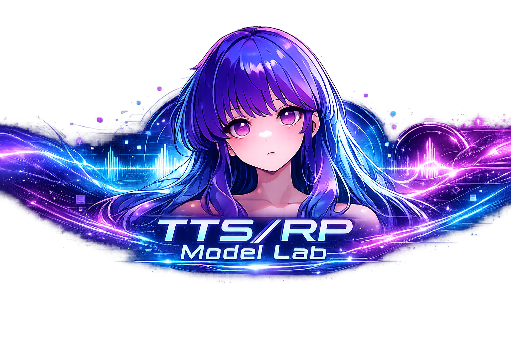

<p align="center">
  
</p>

# TTS 롤플레잉 모델 연구소

TTS 롤플레잉 모델 연구소는 다음 3개 축으로 구성된 실험 저장소입니다.

1. `data`: 멀티턴/싱글턴/번역/GRPO 학습 데이터 생성
2. `models`: RP 모델, 번역 모델, 일본어 TTS 모델 학습 및 추론 테스트
3. `system`: 위 모델들을 연결해 Qwen 텍스트 RP / VLM RP / 번역 / TTS 통합 런타임 제공

## Demonstration

### saya_rp_4b_v3 시연 영상

> 기반 모델: `qwen/qwen3-4b` (Qwen3 계열)  
> 주의 사항:  
> - 7b 모델과 달리 4b 모델은 `junidude14/korean_roleplay_dataset_for_chat_game_2`(약 25,568행 데이터)로 한국어 SFT 학습 후
    자체 생성 데이터(싱글턴 9000개/멀티턴 1300개/GRPO 1000개)로 학습되었습니다(서술+대사 형식).

- [4B 모델 LLM + TTS 적용 비주얼노벨 앱 시연 영상(사야)](https://drive.google.com/file/d/1p1nBAVqP_nOxmGlUcJt3yvy-hmto9RPN/view?usp=sharing)
- [4B 모델 LLM + TTS 적용 비주얼노벨 앱 시연 영상(마이)](https://drive.google.com/file/d/1Y0KAl5NRPhOB8xy9Nw4iejecm2xon4ES/view?usp=sharing)


### saya_rp_7b_v3 시연 영상

> 기반 모델: `yanolja/YanoljaNEXT-EEVE-Instruct-7B-v2-Preview` (Qwen2.5 계열)  
> 주의 사항:  
> - 7b 모델은 추가 한국어 학습 없이 자체 생성 데이터(싱글턴 9000개/멀티턴 1300개/GRPO 1000개)로 학습되었습니다(서술+대사 형식).  

- [LLM + TTS 적용 비주얼노벨 앱 시연 영상(사야)](https://drive.google.com/file/d/1Hde4YxTpXcZsSPXJMuKUYaLJD8tY-FzU/view?usp=sharing)
- [LLM + TTS 적용 비주얼노벨 앱 시연 영상(마이)](https://drive.google.com/file/d/1oD7EyXnQLgBak5yaAljGzDLQX2tg6b9K/view?usp=sharing)


### saya_vlm_3b 시연 영상

> 기반 모델: `kakaocorp/kanana-1.5-v-3b-instruct`
> 주의 사항:  
> - 3b Vision Language Model(VLM)은 추가 한국어 학습 없이 자체 생성 데이터(싱글턴 9000개/멀티턴 400개/GRPO 1000개)로 학습되었습니다(서술+대사 형식). 

- [VLM + TTS 적용 비주얼노벨 앱 시연 영상(사야)](https://drive.google.com/file/d/17Pp_J08UibiMFyvgaLWclk_EvMWBd_W_/view?usp=sharing)

## Architecture Docs

- `system` 전체 구현/구조/기능 문서: [문서](system/system_document.md)
- Qwen WebAPI + REST + Gradio 구조: [문서](system/webapi/api_architecture.md)
- VLM WebAPI + REST + Gradio 구조: [문서](system/webapi_vlm/api_architecture.md)
- 메모리/감정 구조(SQLite + sqlite-vec): [문서](memory_and_emotion.md)
- SQLite/vec 조회 방법: [문서](sqlite.md)

## 0) 빠른 시작

### 0-1. 환경
- Python: `>=3.10,<3.12`
- 권장: `uv`

```bash
cd saya_char_qwen2.5
uv sync
```

의존성 정책:
- 루트 `pyproject.toml`/`requirements.txt`에서는 `torch`를 기본 강제하지 않습니다.
- GPU(특히 RTX 50xx)는 환경별로 torch 빌드가 달라 별도 설치를 전제로 합니다.

### 0-3. 런타임 기본 모델/환경변수

현재 코드 기준 기본 경로:
- Qwen RP LLM: `models/qwen3_core/model_assets/saya_rp_4b_v3`
- VLM RP LLM: `models/qwen3_core/model_assets/saya_vlm_3b`
- 번역기: `models/qwen3_core/model_assets/qtranslator_1.7b_v2`
- TTS 워커: `models/Style-BERT-VITS2/sbv2_worker.py`

루트 초기화 스크립트로 4B 모델 자산 다운로드:
```bash
uv run initialize.py --only runtime_llm_4b_v3
uv run initialize.py --only runtime_llm_4b_v3_sft
```

두 모델은 각각 아래 경로로 저장됩니다.
- `models/qwen3_core/model_assets/saya_rp_4b_v3`
- `models/qwen3_core/model_assets/saya_rp_4b_v3_sft`

Qwen 런타임 오버라이드 환경변수:
- `QWEN_MODEL_DIR`: LLM 모델 경로
- `TRANS_MODEL_DIR`: 번역 모델 경로
- `LLM_BACKEND`: `vllm` 또는 `hf` (기본 `vllm`)
- `LLM_STRICT_VLLM`: `1`이면 vLLM 초기화 실패 시 중단 (기본 `1`)
- `VLLM_MAX_MODEL_LEN`: 기본 1536
- `VLLM_GPU_MEMORY_UTILIZATION`: 기본 0.85
- `VLLM_MAX_NUM_SEQS`: 기본 1

VLM 런타임 오버라이드 환경변수:
- `KANANA_VLM_MODEL_DIR`: VLM 모델 경로
- `KANANA_VLM_LOAD_IN_4BIT`: `1`이면 4bit 로드
- `KANANA_VLM_TRUST_REMOTE_CODE`: 기본 `1`
- `KANANA_VLM_ATTN_IMPL`: 기본 `flash_attention_2`
- `KANANA_VLM_MAX_LENGTH`: 기본 4096
- `KANANA_VLM_DUMMY_IMAGE_SIZE`: 기본 224
- `VLM_MEMORY_DEBUG`: `1`이면 memory retrieval 주입 로그 출력

### 0-2. OpenAI API를 쓰는 파이프라인만 추가 준비
- GPT 기반 데이터 생성/파이프라인은 `OPENAI_API_KEY` 필요
- 루트 `.env` 또는 환경변수 설정

예시 `.env`:
```env
OPENAI_API_KEY=...
```

## 1) 디렉터리 구조

```text
saya_char_qwen2.5/
  data/
    singleturn/     # 싱글턴 생성/정규화/변환/번역SFT셋 생성
    original/       # v5 멀티턴 생성 파이프라인
    version_2/      # v6 멀티턴 생성 파이프라인
    version_3/      # v7 멀티턴 생성 파이프라인
    grpog/          # GRPO용 prompt/reference 데이터셋 생성
  models/
    qwen3_core/     # RP/번역 모델 학습 및 추론
    Style-BERT-VITS2/ # 일본어 TTS 런타임/워커 기준 경로
    sbv2_core/      # 레거시 일본어 TTS 학습/추론/ONNX 변환
    qwen3_reference/ # 모델 구조/동작 학습용 실험 코드
    sbv2_reference/  # 모델 구조/동작 학습용 실험 코드
  system/           # Qwen/VLM/번역/TTS 통합 런타임 모듈
  main_loop.py      # CLI RP 플레이 엔트리
```

## 1-1. 현재 system 런타임 구분

현재 `system`은 두 개의 분리된 웹 런타임을 가진다.

1. `system/webapi`
- Qwen 텍스트 RP 경로
- LangGraph + SummaryMemoryChain 사용
- vLLM 또는 HF backend 가능

2. `system/webapi_vlm`
- Kanana 기반 VLM RP 경로
- 이미지 업로드 지원
- LangGraph + SummaryMemoryChain 사용
- 현재 backend는 Hugging Face `AutoModelForVision2Seq`
- 현재는 vLLM 미사용

즉 Qwen 경로와 VLM 경로는 같은 webui가 아니라 별도 앱으로 분리되어 있다.

## 1-2. 서버 실행

### Qwen WebAPI + Demo

```bash
uv run uvicorn system.webapi.app:app --host 0.0.0.0 --port 8000
```

### VLM WebAPI + Demo

```bash
uv run uvicorn system.webapi_vlm.app:app --host 0.0.0.0 --port 8001
```

### VLM memory retrieval 주입 로그 확인

```bash
export VLM_MEMORY_DEBUG=1
uv run uvicorn system.webapi_vlm.app:app --host 0.0.0.0 --port 8001
```

## 2) Data 파이프라인

## 2-1. 싱글턴 RP 데이터 생성

### A) 로컬 모델 기반 생성
스크립트: `data/singleturn/data_generator_local.py`

```bash
uv run data/singleturn/data_generator_local.py \
  --model_path data/generator/Tri-7B \
  --out_path "$DATA_ROOT/singleturn/rp_generated_local.jsonl" \
  --progress_path "$DATA_ROOT/singleturn/rp_generated_local.progress.json" \
  --target_rows 7000
```

주요 옵션:
- `--temperature`, `--top_p`, `--top_k`, `--max_new_tokens`
- `--no_4bit` (기본은 4bit 경로)

### B) GPT 기반 생성
스크립트: `data/singleturn/data_generator_gpt.py`

```bash
uv run data/singleturn/data_generator_gpt.py \
  --model gpt-4.1-mini \
  --target_rows 12000 \
  --out_path "$DATA_ROOT/singleturn/rp_generated.jsonl" \
  --progress_path "$DATA_ROOT/singleturn/rp_generated.progress.json"
```

출력 스키마(핵심):
- `{system, user, assistant_raw, scene}`

## 2-2. 싱글턴 후처리 (messages 포맷 + 정규화)

### A) messages 포맷 변환
스크립트: `data/singleturn/singleturn_message_converter.py`

```bash
uv run data/singleturn/singleturn_message_converter.py \
  --in_path "$DATA_ROOT/singleturn/rp_generated_local.jsonl" \
  --out_path "$DATA_ROOT/singleturn/rp_generated_local_cleaned.jsonl"
```

### B) 대사/치환 정규화
스크립트: `data/singleturn/singleturn_normalize.py`

```bash
uv run data/singleturn/singleturn_normalize.py \
  --in_jsonl "$DATA_ROOT/singleturn/rp_generated_local_cleaned.jsonl" \
  --out_jsonl "$DATA_ROOT/singleturn/rp_singleturn_cleaned.jsonl" \
  --seed 42
```

정규화 규칙(요약):
- `{{user}}` 치환
- `*` 제거
- assistant 화자 라벨 제거
- assistant 대사 큰따옴표 보정

## 2-3. 멀티턴 데이터 생성 

멀티턴은 3개 버전이 공존합니다.

1. `original` = v5
2. `version_2` = v6
3. `version_3` = v7

모든 파이프라인은 공통적으로 아래 특징이 있습니다.
- `scenario_out`와 `multiturn_out`를 분리 저장
- 파일 라인 수 기준 resume 지원
- Qwen 로컬 백엔드와 GPT 백엔드 둘 다 제공

### A) original (v5)

로컬 Qwen:
```bash
uv run data/original/v5_qwen/pipeline.py \
  --model_path data/generator/Tri-7B \
  --scenario_out "$DATA_ROOT/v5/rp_scenario.jsonl" \
  --samples 5000 \
  --multiturn_out "$DATA_ROOT/v5/rp_datum.jsonl" \
  --fsm_path data/original/v5_qwen/state_fsm.yaml \
  --action_fsm_path data/original/v5_qwen/action_fsm.yaml \
  --turns 6 \
  --use_4bit
```

GPT:
```bash
uv run data/original/v5_gpt/pipeline.py \
  --openai_model gpt-5-mini \
  --scenario_out "$DATA_ROOT/v5/rp_scenario_gpt.jsonl" \
  --samples 5000 \
  --multiturn_out "$DATA_ROOT/v5/rp_datum_gpt.jsonl" \
  --fsm_path data/original/v5_qwen/state_fsm.yaml \
  --action_fsm_path data/original/v5_qwen/action_fsm.yaml \
  --turns 6
```

### B) version_2 (v6)

로컬 Qwen:
```bash
uv run data/version_2/v6_qwen/pipeline.py \
  --model_path data/generator/Tri-7B \
  --scenario_out "$DATA_ROOT/v6/v2_scenario.jsonl" \
  --samples 5000 \
  --multiturn_out "$DATA_ROOT/v6/v2_datum.jsonl" \
  --fsm_path data/version_2/v6_qwen/state_fsm.yaml \
  --action_fsm_path data/version_2/v6_qwen/action_fsm.yaml \
  --turns 8 \
  --use_4bit
```

GPT:
```bash
uv run data/version_2/v6_gpt/pipeline.py \
  --openai_model gpt-5-mini \
  --scenario_out "$DATA_ROOT/v6/rp_scenario_gpt.jsonl" \
  --samples 5000 \
  --multiturn_out "$DATA_ROOT/v6/rp_datum_gpt.jsonl" \
  --fsm_path data/version_2/v6_qwen/state_fsm.yaml \
  --action_fsm_path data/version_2/v6_qwen/action_fsm.yaml \
  --turns 8
```

### C) version_3 (v7)

로컬 Qwen:
```bash
uv run data/version_3/v7_qwen/pipeline.py \
  --model_path data/generator/Tri-7B \
  --scenario_out "$DATA_ROOT/v7/v3_scenario.jsonl" \
  --samples 5000 \
  --multiturn_out "$DATA_ROOT/v7/v3_datum.jsonl" \
  --fsm_path data/version_3/v7_qwen/state_fsm.yaml \
  --action_fsm_path data/version_3/v7_qwen/action_fsm.yaml \
  --turns 8 \
  --use_4bit
```

GPT:
```bash
uv run data/version_3/v7_gpt/pipeline.py \
  --openai_model gpt-5-mini \
  --scenario_out "$DATA_ROOT/v7/rp_scenario_gpt.jsonl" \
  --samples 5000 \
  --multiturn_out "$DATA_ROOT/v7/rp_datum_gpt.jsonl" \
  --fsm_path data/version_3/v7_qwen/state_fsm.yaml \
  --action_fsm_path data/version_3/v7_qwen/action_fsm.yaml \
  --turns 4
```

## 2-4. 번역 SFT 데이터셋 생성

스크립트: `data/singleturn/jsonl_to_translation_sft.py`

현재 이 파일은 상단 상수(`INPUT_JSONL_PATH`, `OUTPUT_JSONL_PATH`)를 직접 사용합니다.
필요시 파일 상단 경로를 원하는 경로로 수정 후 실행하세요.

```bash
uv run data/singleturn/jsonl_to_translation_sft.py
```

출력 스키마:
- `{instruction, input, output}`

## 2-5. GRPO 학습 데이터셋 생성

스크립트: `data/grpog/build_grpo_dataset.py`

```bash
uv run data/grpog/build_grpo_dataset.py \
  --inputs "$DATA_ROOT/singleturn/rp_singleturn_cleaned.jsonl" "$DATA_ROOT/v7/rp_datum_unite_cleaned.jsonl" \
  --out_train "$DATA_ROOT/grpo/grpo_train.jsonl" \
  --out_eval "$DATA_ROOT/grpo/grpo_eval.jsonl" \
  --eval_ratio 0.05 \
  --seed 42 \
  --max_context_messages 12 \
  --min_prompt_chars 8 \
  --min_reference_chars 4 \
  --tokenizer_path models/qwen3_core/model_assets/qwen3_4b_rp \
  --max_prompt_tokens 1024 \
  --max_reference_tokens 220
```

## 3) Models 파이프라인

## 3-1. Qwen RP 모델

## A) 베이스 모델 다운로드
스크립트: `models/qwen3_core/initialize.py`

```bash
uv run models/qwen3_core/initialize.py
```

현재 `initialize.py`의 `MODELS`에 정의된 모델만 다운로드됩니다.

## B) SFT (QLoRA) Stage 1/2
스크립트: `models/qwen3_core/sft_trainer_qlora.py`

Stage 1 (singleturn):
```bash
uv run models/qwen3_core/sft_trainer_qlora.py \
  --model_name models/qwen3_core/model_assets/qwen3-4b-instruct \
  --data_path "$DATA_ROOT/singleturn/rp_singleturn_cleaned.jsonl" \
  --output_dir models/qwen3_core/model_assets/qwen3_4b_rp_lora_stage1 \
  --load_in_4bit \
  --bf16 \
  --gradient_checkpointing \
  --max_length 4096 \
  --per_device_train_batch_size 1 \
  --gradient_accumulation_steps 16 \
  --num_train_epochs 8 \
  --learning_rate 2e-5 \
  --assistant_only_loss
```

Stage 2 (multiturn):
```bash
uv run models/qwen3_core/sft_trainer_qlora.py \
  --model_name models/qwen3_core/model_assets/qwen3-4b-instruct \
  --data_path "$DATA_ROOT/v7/rp_datum_unite_cleaned.jsonl" \
  --output_dir models/qwen3_core/model_assets/qwen3_4b_rp_lora_stage2 \
  --init_adapter_path models/qwen3_core/model_assets/qwen3_4b_rp_lora_stage1/lora_adapter \
  --load_in_4bit \
  --bf16 \
  --gradient_checkpointing \
  --max_length 4096 \
  --per_device_train_batch_size 1 \
  --gradient_accumulation_steps 16 \
  --num_train_epochs 4 \
  --learning_rate 2e-5 \
  --assistant_only_loss
```

## C) LoRA 병합
스크립트: `models/qwen3_core/merge.py`

```bash
uv run models/qwen3_core/merge.py \
  --base_model models/qwen3_core/model_assets/qwen3-4b-instruct \
  --adapter_path models/qwen3_core/model_assets/qwen3_4b_rp_lora_stage2/lora_adapter \
  --output_dir models/qwen3_core/model_assets/qwen3_4b_rp \
  --dtype bf16 \
  --device_map auto \
  --safe_serialization \
  --trust_remote_code
```

## D) GRPO 학습
스크립트: `models/qwen3_core/grpo_trainer.py`

```bash
PYTORCH_CUDA_ALLOC_CONF=expandable_segments:True \
uv run models/qwen3_core/grpo_trainer.py \
  --model_name models/qwen3_core/model_assets/qwen3_4b_rp \
  --train_data "$DATA_ROOT/grpo/grpo_train.jsonl" \
  --eval_data "$DATA_ROOT/grpo/grpo_eval.jsonl" \
  --output_dir models/qwen3_core/model_assets/qwen3_4b_rp_grpo \
  --per_device_train_batch_size 1 \
  --gradient_accumulation_steps 16 \
  --num_train_epochs 2 \
  --learning_rate 2e-6 \
  --max_prompt_length 1024 \
  --max_completion_length 220 \
  --num_generations 4 \
  --bf16 \
  --use_lora \
  --load_in_4bit
```

## E) RP 추론 테스트
- `models/qwen3_core/infer_singleturn_merged.py`
- `models/qwen3_core/infer_singleturn_lora.py`

```bash
uv run models/qwen3_core/infer_singleturn_merged.py
```

(대화형 루프, `exit` 입력 시 종료)

## 3-2. 번역 모델 (KO->JA)

## A) 번역 SFT 학습
스크립트: `models/qwen3_core/sft_trainer_translator.py`

```bash
uv run models/qwen3_core/sft_trainer_translator.py \
  --model_name models/qwen3_core/model_assets/qwen3-1.7b-base \
  --data_path "$DATA_ROOT/singleturn/ko-ja_translation_sft.jsonl" \
  --output_dir models/qwen3_core/model_assets/qwen3_1.7_ko2ja_lora \
  --bf16 \
  --gradient_checkpointing
```

## B) 번역 추론 테스트 (LoRA)
스크립트: `models/qwen3_core/infer_translate_lora.py`

```bash
uv run models/qwen3_core/infer_translate_lora.py \
  --base_dir models/qwen3_core/model_assets/qwen3-1.7b-base \
  --lora_dir models/qwen3_core/model_assets/qwen3_1.7_ko2ja_lora/lora_adapter \
  --text "오늘은 좀 피곤해." \
  --instruction "다음 한국어 문장을 자연스러운 일본어로 번역하시오."
```

## 3-3. 일본어 TTS 모델 (Style-Bert-VITS2)

기준 날짜: `2026-03-01`

현재 운영 기준 작업 디렉터리는 `models/Style-BERT-VITS2`입니다.

현행 파이프라인은 `litagin02/Style-Bert-VITS2` 복구본을 `models/Style-BERT-VITS2`에 정리한 뒤,
이 저장소의 런타임 요구사항만 최소한으로 추가한 구조입니다.

구성 요소:
- 상주 워커: `models/Style-BERT-VITS2/sbv2_worker.py`
- ONNX 런타임: `models/Style-BERT-VITS2/sbv_runtime`
- 시스템 연동 진입점: `system/tts_worker_client.py`

RTX 5080 / WSL 기준 메모:
- `models/Style-BERT-VITS2` 내부 별도 `venv`를 기준으로 설치/실행합니다.
- `uv run --active --no-sync ...` 형태로 기존 환경을 재사용하는 흐름을 우선 사용합니다.

### A) 현재 시스템 연동 워크플로우
1. `system/tts_worker_client.py`가 `models/Style-BERT-VITS2/sbv2_worker.py`를 서브프로세스로 실행합니다.
2. `sbv2_worker.py`가 `saya` 또는 `mai`용 ONNX 모델을 1회 로드합니다.
3. 워커는 `sbv_runtime.engine.build_runtime(...)`으로 ONNX Runtime + BERT ONNX 경로를 고정합니다.
4. 요청 payload(`text`, `style`, `style_weight`, `speaker_name`)를 stdin JSON으로 받습니다.
5. `runtime.model.infer(...)`로 추론 후 `outputs/tts_*.wav`를 생성합니다.
6. 생성된 wav 경로를 stdout JSON으로 반환하고, WebAPI/CLI가 그 경로를 소비합니다.

참고:
- 실제 런타임 경로는 `model_assets/saya/`와 `model_assets/mai/`입니다.
- `bert/deberta-v2-large-japanese-char-wwm/` 아래 tokenizer + `pytorch_model.bin`이 필요합니다.
- `bert/deberta-v2-large-japanese-char-wwm-onnx/` 아래 tokenizer + `model_fp16.onnx`가 필요합니다.

초기화:
```bash
uv run initialize.py --only tts_saya_v2
```

또는:
```bash
uv run initialize.py --only tts_mai_v2
```

루트 `initialize.py`는 TTS 화자 ONNX 자산뿐 아니라, 현재 워커가 직접 참조하는
일본어 BERT 본체(`pytorch_model.bin`)와 ONNX BERT(`model_fp16.onnx`)도 함께 다운로드합니다.
따라서 SBV2 워커를 `main_loop.py`에서 바로 쓸 때는 별도로
`models/Style-BERT-VITS2/initialize.py`를 먼저 돌리지 않아도 되도록 맞춰 둔 상태입니다.

### B) 레거시 경로(sbv2_core)
`models/sbv2_core`는 과거 실험/변환 스크립트 보관용입니다.
신규 학습/런타임은 `models/Style-BERT-VITS2` 기준을 사용합니다.
레거시 학습/사용법은 `sbv2_core_legacy.md`로 분리했습니다.

## 4) System 파이프라인 (텍스트+음성 RP CLI)

엔트리: `main_loop.py`

```bash
uv run main_loop.py
```

REST API + 데모 UI 실행:
```bash
uv run uvicorn system.webapi.app:app --host 0.0.0.0 --port 8000
```

접속:
- OpenAPI: `http://127.0.0.1:8000/docs`
- Gradio demo: `http://127.0.0.1:8000/demo`

REST 엔드포인트(현재):
- `GET /health`
- `POST /api/chat`
- `POST /api/parse`
- `POST /api/translate`
- `POST /api/tts`
- `POST /api/turn`
- `POST /api/main-loop` (데모 기본 경로, `/api/turn`과 동일 파이프라인)

실행 흐름(메인 루프):
1. `system/llm_engine.py`에서 RP 응답 생성
2. `system/rp_parser.py`로 서술/대사 분리
3. `system/translator.py`로 KO->JA 번역
4. `system/tts_worker_client.py`가 `models/Style-BERT-VITS2/sbv2_worker.py`와 통신해 WAV 생성
5. 감정 JSON(one-hot) 판정 후 UI 이미지 선택(웹)
6. `ffplay`로 재생(CLI)

필수:
- `ffplay` 설치 필요 (`ffmpeg` 패키지)
- `system/llm_engine.py`, `system/translator.py`, `models/Style-BERT-VITS2/sbv2_worker.py`의 모델 경로가 현재 로컬 환경과 맞아야 함
- 메모리 DB는 기본 `outputs/memory/memory.sqlite3`를 사용하며, sqlite-vec 로드 가능 시 벡터 검색이 자동 활성화됩니다.

## 5) 산출물 위치 정리

대표 산출물:
- 싱글턴 생성: `$DATA_ROOT/singleturn/*.jsonl`
- 멀티턴 생성: `$DATA_ROOT/v5/*.jsonl`, `$DATA_ROOT/v6/*.jsonl`, `$DATA_ROOT/v7/*.jsonl`
- GRPO 데이터: `$DATA_ROOT/grpo/*.jsonl`
- RP LoRA/머지 모델: `models/qwen3_core/model_assets/*`
- 번역 LoRA/머지 모델: `models/qwen3_core/model_assets/*`
- TTS 체크포인트/ONNX: `models/Style-BERT-VITS2/model_assets/<voice>/`
- TTS 테스트 WAV: `models/Style-BERT-VITS2/outputs/` 또는 실행 시 지정 경로

## 6) 자주 발생하는 문제와 원인

## 6-1. `model_fp16.onnx` 로드 실패
에러 예시:
- `Type Error: Type (tensor(float16)) of output arg (...) does not match expected type (tensor(float))`

원인:
- DeBERTa BERT ONNX FP16 변환 시 그래프 타입 규약 깨짐

대응:
- `model_fp16.onnx` 제거
- `model.onnx`(FP32)만 사용

## 6-2. `word2ph` 길이 오류/토크나이저 불일치
원인:
- 외부 프로젝트로 이동 시 `pyopenjtalk`, `transformers`, tokenizer/BERT 파일 버전 차이

대응:
- `sbv_runtime/requirements_runtime_onnx.txt` 버전 고정 사용
- BERT tokenizer 파일과 ONNX 모델을 항상 같은 소스에서 함께 배포

## 6-3. CUDA provider 미검출
에러/경고 예시:
- `CUDAExecutionProvider is not in available provider names`

원인:
- `onnxruntime-gpu` 미설치 또는 CUDA 런타임 불일치

대응:
- CPU 실행으로 먼저 검증
- CUDA 사용 시 `onnxruntime-gpu` + 드라이버/CUDA 호환성 점검

## 6-4. RTX 50xx + Torch 커널 오류
에러 예시:
- `no kernel image is available for execution on the device`

원인:
- 설치된 torch 빌드가 GPU 아키텍처(sm_120)를 지원하지 않음

대응:
- 사용하려는 torch 빌드를 환경에서 명시 고정
- `uv` 동기화 시 재설치가 일어나지 않도록 lock/의존성 정책 점검

## 6-5. `ffplay`가 없어서 재생 실패
에러 예시:
- `[Errno 2] No such file or directory: 'ffplay'`

원인:
- TTS WAV 생성은 끝났지만, CLI 재생 단계에서 `ffplay` 실행 파일을 찾지 못함

대응:
- Ubuntu/WSL에서 `sudo apt-get install -y ffmpeg`
- `which ffplay`로 설치 확인
- 서버/API 용도라면 자동 재생 없이 WAV 파일만 소비하도록 사용

## 6-6. GRPO 실행 중 `max_prompt_length` 인자 오류
에러 예시:
- `TypeError: GRPOConfig.__init__() got an unexpected keyword argument 'max_prompt_length'`

원인:
- 설치된 `trl` 버전마다 `GRPOConfig` 지원 인자가 다름

대응:
- 현재 `models/qwen3_core/grpo_trainer.py`는 지원 인자만 자동 주입하도록 호환 처리되어 있습니다.
- 미지원 인자는 경고 로그 후 자동 제외됩니다.

## 6-7. `flash-attn` 설치
목적:
- VLM/LLM 학습 시 FlashAttention2 경로를 사용하기 위해 `flash-attn` 설치

설치:
```bash
sudo apt-get update
sudo apt-get install nvidia-cuda-toolkit
nvcc --version
uv pip install flash-attn --no-build-isolation
```

확인:
```bash
uv run python -c "import flash_attn; print(flash_attn.__version__)"
```

주의:
- 소스 빌드라 설치 시간이 오래 걸릴 수 있습니다.
- 컴파일 중에는 `nvcc`, `cicc`, `ninja` 프로세스가 보이는 것이 정상입니다.


## 7) 권장 운영 순서

1. `data`: singleturn/multiturn/translation/grpo 데이터 준비
2. `models/qwen3_core`: RP SFT -> merge -> (선택) GRPO
3. `models/qwen3_core`: 번역 SFT -> infer 검증
4. `models/Style-BERT-VITS2`: TTS 런타임/워커 기준 경로
5. `main_loop.py` 또는 `sbv_runtime`로 통합 테스트

## 8) Limitation

- 한일 번역 모델의 훈련에는 싱글턴 생성 데이터셋의 구어체 번역 항목이 사용되었습니다.
  - GPT 4.1 모델의 번역 품질과 Qwen3-1.7B 모델의 한계에 의해 좌우됩니다.
  - 일반 일본어 구어체 데이터로 학습되었으므로 특정 캐릭터의 말투에 맞추어져 있지 않습니다.
- SBV2 모델은 자체적인 생성 데이터셋으로 학습되었습니다.
  - 오리지날 `litagin02/Style-Bert-VITS2`의 사전학습 모델을 사용하지 않았습니다.
  - 현재 코드베이스는 오리지날 SBV2 파이프라인을 복구한 상태를 기준으로 유지하고 있습니다.
- 장기 기억을 위해 SQLite-vec이 사용되었습니다.

## 9) Planned Work

- 모델 추가 학습(한국어 능력 향상 및 GRPO 의미 유사도 관련 보상 함수 제거)
- 감정 상태 시스템 고도화
- 음성 Style 반영


## 10) References

- Qwen (Alibaba Cloud) GitHub: https://github.com/QwenLM/Qwen3
- Qwen (Alibaba Cloud) Hugging Face: https://huggingface.co/Qwen
- Tri-7B (Trillion Labs) Hugging Face: https://huggingface.co/trillionlabs/Tri-7B
- Embedding model (BAAI BGE-M3) Hugging Face: https://huggingface.co/BAAI/bge-m3
- Style-Bert-VITS2 (base TTS pipeline) GitHub: https://github.com/litagin02/Style-Bert-VITS2
- Style-BERT-VITS2-GeneLab-Blackwell (hiroki-abe-58) GitHub: https://github.com/hiroki-abe-58/Style-BERT-VITS2-GeneLab-Blackwell
- ComfyUI VNCCS (AHEKOT) GitHub: https://github.com/AHEKOT/ComfyUI_VNCCS
